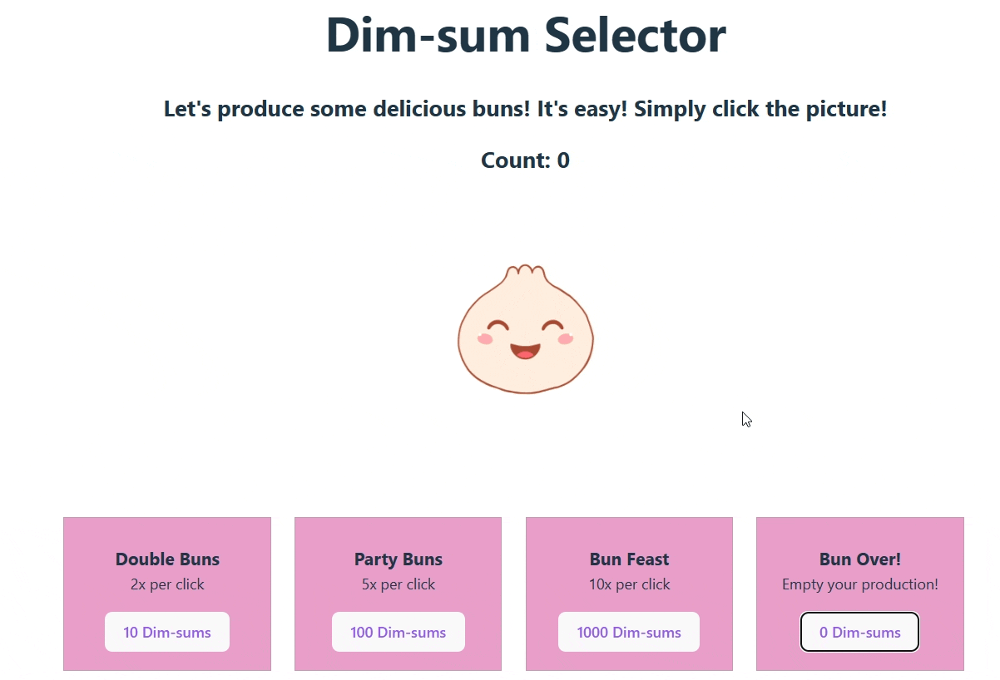

# Dim-sum Selector
This is a REACT based one page application for an incremental selector game. The bun can be collected by clicking. Then the user can upgrade certain power-ups based on the count. Last, the user can empty the count and restart the game. 

Tools and Libraries:
*  React.js: Built successfully by implementing State Hook feature and Event Hnadling. 
*  Vite: Provided the REACT environment.

## Video Walkthrough

Here's a walkthrough of implemented features:

created with Gifcap 